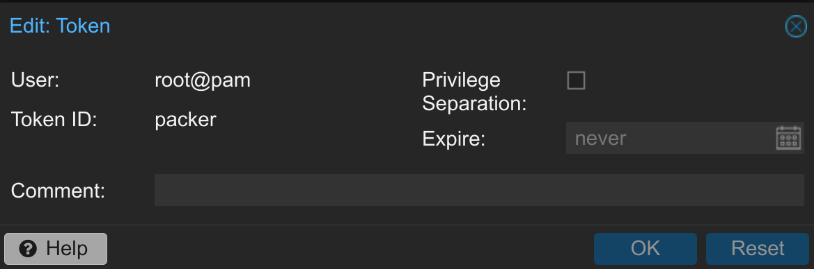

# Proxmox and KVM related Virtual Machines using Hashicorp's Packer


[](https://www.buymeacoffee.com/marcinbojko)

Consider buying me a coffee if you like my work. All donations are appreciated. All donations will be used to pay for pipeline running costs
<!-- TOC -->

- [Proxmox and KVM related Virtual Machines using Hashicorp's Packer](#proxmox-and-kvm-related-virtual-machines-using-hashicorps-packer)
  - [Proxmox](#proxmox)
    - [Proxmox requirements](#proxmox-requirements)
    - [Usage](#usage)
    - [Provisioning](#provisioning)
  - [KVM](#kvm)
    - [KVM Requirements](#kvm-requirements)
    - [Cloud-init support](#cloud-init-support)
      - [RHEL](#rhel)
      - [Ubuntu](#ubuntu)
    - [KVM scripts usage](#kvm-scripts-usage)
      - [Parameters](#parameters)
      - [KVM building scripts, by OS with cloud parameters](#kvm-building-scripts-by-os-with-cloud-parameters)
  - [Default credentials](#default-credentials)
  - [Known Issues](#known-issues)
    - [Windows UEFI boot and 'Press any key to boot from CD or DVD' issue](#windows-uefi-boot-and-press-any-key-to-boot-from-cd-or-dvd-issue)
    - [OpenSuse Leap stage 2 sshd fix](#opensuse-leap-stage-2-sshd-fix)
  - [To DO](#to-do)
  - [Q & A](#q--a)

<!-- /TOC -->
<!-- /TOC -->
## Proxmox

### Proxmox requirements

- [Packer](https://www.packer.io/downloads) in version >= 1.10.0
- [Proxmox](https://www.proxmox.com/en/downloads) in version >= 8.0 with CEPH and ZFS storage
- [Ansible] in version >= 2.10.0
- tested with `AMD Ryzen 9 5950X`, `Intel(R) Core(TM) i3-7100T`
- at least 2GB of free RAM for virtual machines (4GB recommended)
- at least 100GB of free disk space for virtual machines (200GB recommended) on fast storage (SSD/NVME with LVM thinpool or ZFS)

### Usage

- Init packer by running  `packer init config.pkr.hcl` or `packer init -upgrade config.pkr.hcl`
- Init your ansible by running `ansible-galaxy collection install --upgrade -r ./extra/playbooks/requirements.yml`
- Generate new user or token for existing user in Proxmox - `Datacenter/Pemissions/API Tokens`

  Do not mark `Privilege separation` checkbox, unless you have dedicated role prepared.

  Example token:

  

- create and use env variables for secrets `/secrets/proxmox.sh` with content similar to:

    ```bash
    export PROXMOX_URL="https://someproxmoxserver:8006/api2/json"
    export PROXMOX_USERNAME="root@pam!packer"
    export PROXMOX_TOKEN="xxxxxxxxxxxxxxxxx"
    ```

- adjust required variables in `proxmox/variables*.pkvars.hcl` files especially datastore names (`storage_pool`, `iso_file`, `iso_storage_pool`) in:

  ```hcl
      disks = {
          cache_mode              = "writeback"
          disk_size               = "50G"
          format                  = "raw"
          type                    = "sata"
          storage_pool            = "zfs"
      }
  ```

  ```ini
  iso_file                    = "images:iso/20348.169.210806-2348.fe_release_svc_refresh_SERVER_EVAL_x64FRE_en-us.iso"
  iso_storage_pool            = "local"
  proxmox_node                = "proxmox5"
  virtio_iso_file             = "images:iso/virtio-win.iso"
  ```

  ```hcl
  network_adapters = {
    bridge                  = "vmbr0"
    model                   = "virtio"
    firewall                = false
    mac_address             = ""
  }

  ```

- run proper script for dedicated OS

  | OS | script | Comments|
  |----|--------|---------|
  | Alma Linux 8.8        | `./proxmox_almalinux_88.sh` | |
  | Alma Linux 8.9        | `./proxmox_almalinux_89.sh` | |
  | Alma Linux 9.2        | `./proxmox_almalinux_92.sh` | |
  | Alma Linux 9.3        | `./proxmox_almalinux_93.sh` | |
  | Alma Linux 9.4        | `./proxmox_almalinux_94.sh` | |
  | OpenSuse Leap 15.5    | `./proxmox_opensuse_leap_15_5.sh` | |
  | Oracle Linux 8.8      | `./proxmox_oraclelinux_88.sh` | |
  | Oracle Linux 8.9      | `./proxmox_oraclelinux_89.sh` | |
  | Oracle Linux 9.2      | `./proxmox_oraclelinux_92.sh` | |
  | Oracle Linux 9.3      | `./proxmox_oraclelinux_93.sh` | |
  | Oracle Linux 9.4      | `./proxmox_oraclelinux_94.sh` | |
  | Rocky Linux 8.8       | `./proxmox_rockylinux_88.sh` | |
  | Rocky Linux 8.9       | `./proxmox_rockylinux_89.sh` | |
  | Rocky Linux 9.2       | `./proxmox_rockylinux_92.sh` | |
  | Rocky Linux 9.3       | `./proxmox_rockylinux_93.sh` | |
  | Rocky Linux 9.4       | `./proxmox_rockylinux_94.sh` | |
  | Ubuntu 22.04 HWE LTS  | `./proxmox_ubuntu_2204_hwe.sh` | HWE Kernel|
  | Ubuntu 22.04 LTS      | `./proxmox_ubuntu_2204.sh` | |
  | Ubuntu 23.04          | `./proxmox_ubuntu_2304.sh` | |
  | Microsoft Windows 2022 Datacenter   | `./proxmox_windows_2022-dc.sh` |Datacenter Edition |
  | Microsoft Windows 2022 Standard     | `./proxmox_windows_2022-std.sh` |Standard Edition |
  | Microsoft Windows 2019 Standard     | `./proxmox_windows_2019-std.sh` |Standard Edition |
  | Microsoft Windows 2019 Datacenter   | `./proxmox_windows_2019-dc.sh` |Datacenter Edition |

### Provisioning

- For RHEl-based machines, provisioning is done by Ansible Playbooks `extra/playbooks` using variables from `variables/` folder

example:

  ```yaml
  install_epel:                  true
  install_webmin:                false
  install_hyperv:                false
  install_cockpit:               true
  install_neofetch:              true
  install_updates:               true
  install_extra_groups:          true
  docker_prepare:                false
  extra_device:                  ""
  install_motd:                  true
  ```

- For Ubuntu-based machines provisioning is done by scripts from `extra/files/gen2-ubuntu*` folders

- For Windows-based machines provisioning is done by Powershell scripts located in `extra/scripts/*`

## KVM

### KVM Requirements

- [Packer](https://www.packer.io/downloads) in version >= 1.9.2
- [Ansible] in version >= 2.10.0
- tested with `AMD Ryzen 9 5950X`, `Intel(R) Core(TM) i3-7100T`
- at least 2GB of free RAM for virtual machines (4GB recommended)
- KVM hypervisor

### Cloud-init support

KVM builds are separated by cloud-init groups. Currently supported groups are:

#### RHEL

- generic - generic cloud-init configuration
- oci - Oracle Cloud Infrastructure cloud-init configuration
- alicloud - Alibaba Cloud cloud-init configuration

#### Ubuntu

### KVM scripts usage

- Init packer by running  `packer init config.pkr.hcl`
- Scripts have `kvm_` prefix

#### Parameters

KVM building scripts will take 2 runtime parameters:

- $1 - PACKER_LOG settings, can be 0 or 1 (can be skipped)
- $2 - cloud-init group, can be:  `generic`, `oci` or `alicloud` (can be skipped)

Example:

```bash
./kvm_rockylinux92.sh 1 generic #This will build Rocky Linux 9.2 with generic cloud-init configuration and PACKER_LOG set to verbose output
```

Example 2

```bash
./kvm_rockylinux92.sh oci #This will build Rocky Linux 9.2 with oci cloud-init configuration and PACKER_LOG set to 0 (default)
```

#### KVM building scripts, by OS with cloud parameters

| OS | script | Comments|Generic|OCI|AliCloud|
|----|--------|---------|-------|---|--------|
| Alma Linux 8.7          | `./kvm_oraclelinux87.sh`  | | generic/empty | oci | alicloud |
| Alma Linux 8.8          | `./kvm_oraclelinux88.sh`  | | generic/empty | oci | alicloud |
| Alma Linux 8.9          | `./kvm_oraclelinux89.sh`  | | generic/empty | oci | alicloud |
| Alma Linux 9.0          | `./kvm_oraclelinux90.sh`  | | generic/empty | oci | alicloud |
| Alma Linux 9.1          | `./kvm_oraclelinux91.sh`  | | generic/empty | oci | alicloud |
| Alma Linux 9.2          | `./kvm_oraclelinux92.sh`  | | generic/empty | oci | alicloud |
| Alma Linux 9.3          | `./kvm_oraclelinux93.sh`  | | generic/empty | oci | alicloud |
| Alma Linux 9.4          | `./kvm_oraclelinux94.sh`  | | generic/empty | oci | alicloud |
| Oracle Linux 8.6        | `./kvm_oraclelinux86.sh`  | | generic/empty | oci | alicloud |
| Oracle Linux 8.7        | `./kvm_oraclelinux87.sh`  | | generic/empty | oci | alicloud |
| Oracle Linux 8.8        | `./kvm_oraclelinux88.sh`  | | generic/empty | oci | alicloud |
| Oracle Linux 8.9        | `./kvm_oraclelinux89.sh`  | | generic/empty | oci | alicloud |
| Oracle Linux 9.0        | `./kvm_oraclelinux90.sh`  | | generic/empty | oci | alicloud |
| Oracle Linux 9.1        | `./kvm_oraclelinux91.sh`  | | generic/empty | oci | alicloud |
| Oracle Linux 9.2        | `./kvm_oraclelinux92.sh`  | | generic/empty | oci | alicloud |
| Oracle Linux 9.3        | `./kvm_oraclelinux93.sh`  | | generic/empty | oci | alicloud |
| Oracle Linux 9.4        | `./kvm_oraclelinux94.sh`  | | generic/empty | oci | alicloud |
| Rocky Linux 8.7         | `./kvm_rockylinux87.sh`   | | generic/empty | oci | alicloud |
| Rocky Linux 8.8         | `./kvm_rockylinux88.sh`   | | generic/empty | oci | alicloud |
| Rocky Linux 8.9         | `./kvm_rockylinux89.sh`   | | generic/empty | oci | alicloud |
| Rocky Linux 9.0         | `./kvm_rockylinux90.sh`   | | generic/empty | oci | alicloud |
| Rocky Linux 9.1         | `./kvm_rockylinux91.sh`   | | generic/empty | oci | alicloud |
| Rocky Linux 9.2         | `./kvm_rockylinux92.sh`   | | generic/empty | oci | alicloud |
| Rocky Linux 9.3         | `./kvm_rockylinux93.sh`   | | generic/empty | oci | alicloud |
| Rocky Linux 9.4         | `./kvm_rockylinux94.sh`   | | generic/empty | oci | alicloud |

## Default credentials

|OS|username|password|
|--|--------|--------|
|Windows|Administrator|password|
|Alma/Rocky/Oracle|root|password|
|OpenSuse|root|password|
|Ubuntu|ubuntu|password|

## Known Issues

### Windows UEFI boot and 'Press any key to boot from CD or DVD' issue

When using the `proxmox` builder with `efi` firmware, the Windows installer will not boot automatically. Instead, it will display the message `Press any key to boot from CD or DVD` and wait for user input. User needs to properly adjust `boot_wait` and `boot_command` wait times to find the right balance between waiting for the installer to boot and waiting for the user to press a key.

### OpenSuse Leap stage 2 sshd fix

When building OpenSuse Leap 15.x sshd service starts in stage 2 which breaks packer scripts. There is an artificial delay added to builder (6 minutes) to wait for sshd to start. This is not ideal solution, but it works.

## To DO

- ansible playbooks for Windows and Ubuntu machines
- OpenSuse Leap 15.x
  - OpenSuse Leap stage 2 sshd fix
- Debian 12

## Q & A

Q: Will you add support for other OSes?
A: Yes, I will add support for other OSes as I need them. If you need support for a specific OS, please open an issue and I will try to add it.

Q: Will you add support for other hypervisors?
A: No, this repository is dedicated to Proxmox and KVM. If you need support for other hypervisors, please look at my other repositories

Q: Will you add support for other cloud providers?
A: Since some of cloud providers are using KVM based hypervisors, building custom image with KVM and importing them will solve the case

Q: Will you add support RHEL and RedHat based OSes?
A: No, I will not add support for RHEL and RedHat directly, due to their licensing. However, I will add support for RHEL based OSes like AlmaLinux, Oracle Linux and Rocky Linux.

Q: Can I help?
A: Yes, please open an issue or a pull request and I will try to help you. Please split PRs into separate commits for block of changes.

Q: Can I use this repository for my own projects?
A: Yes, this repository is licensed under the Apache 2 license, so you can use it for your own projects. Please note that some of the files are licensed under different licenses, so please check the licenses of the individual files before using them
