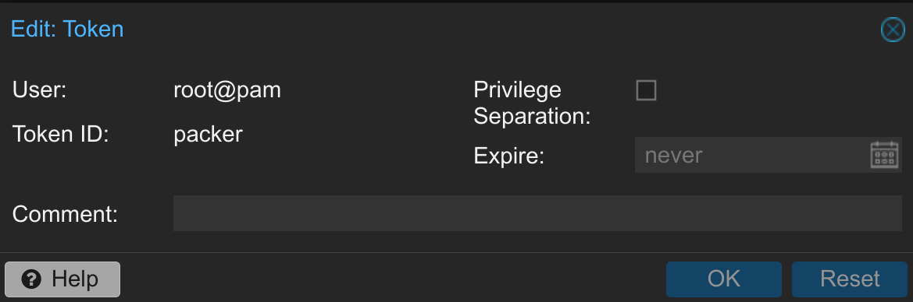

# Proxmox and KVM related Virtual Machines using Hashicorp's Packer


[](https://www.buymeacoffee.com/marcinbojko)

<!-- TOC -->

- [Proxmox and KVM related Virtual Machines using Hashicorp's Packer](#proxmox-and-kvm-related-virtual-machines-using-hashicorps-packer)
  - [Proxmox](#proxmox)
    - [Proxmox requirements](#proxmox-requirements)
    - [Usage](#usage)
    - [Cloud-init drive](#cloud-init-drive)
    - [Provisioning](#provisioning)
    - [Updates](#updates)
  - [KVM](#kvm)
    - [KVM Requirements](#kvm-requirements)
    - [Cloud-init support](#cloud-init-support)
      - [RHEL](#rhel)
      - [Ubuntu](#ubuntu)
    - [KVM scripts usage](#kvm-scripts-usage)
      - [Prerequisites](#prerequisites)
      - [Parameters](#parameters)
      - [Basic usage](#basic-usage)
    - [KVM building scripts, by OS with cloud parameters](#kvm-building-scripts-by-os-with-cloud-parameters)
      - [AlmaLinux](#almalinux)
      - [Oracle Linux](#oracle-linux)
      - [Rocky Linux](#rocky-linux)
      - [Migration from Legacy Scripts](#migration-from-legacy-scripts)
      - [Old vs New Command Examples](#old-vs-new-command-examples)
  - [Default credentials](#default-credentials)
  - [Known Issues](#known-issues)
    - [Windows UEFI boot and 'Press any key to boot from CD or DVD' issue](#windows-uefi-boot-and-press-any-key-to-boot-from-cd-or-dvd-issue)
    - [OpenSuse Leap stage 2 sshd fix](#opensuse-leap-stage-2-sshd-fix)
  - [To DO](#to-do)
  - [Q & A](#q--a)

<!-- /TOC -->

Consider buying me a coffee if you like my work. All donations are appreciated. All donations will be used to pay for pipeline running costs

## Proxmox

### Proxmox requirements

- [Packer](https://www.packer.io/downloads) in version >= 1.10.0
- [Proxmox](https://www.proxmox.com/en/downloads) in version >= 8.0 with any storage (tested with CEPH and ZFS)
- [Ansible] in version >= 2.10.0
- tested with `AMD Ryzen 9 5950X`, `Intel(R) Core(TM) i3-7100T`
- at least 2GB of free RAM for virtual machines (4GB recommended)
- at least 100GB of free disk space for virtual machines (200GB recommended) on fast storage (SSD/NVME with LVM thinpool, Ceph or ZFS)
- virtio iso file in at least 1.271 version [https://fedorapeople.org/groups/virt/virtio-win/direct-downloads/archive-virtio/virtio-win-0.1.271-1/virtio-win.iso](https://fedorapeople.org/groups/virt/virtio-win/direct-downloads/archive-virtio/virtio-win-0.1.271-1/virtio-win.iso)

### Usage

- Init packer by running `packer init config.pkr.hcl` or `packer init -upgrade config.pkr.hcl`
- Init your ansible by running `ansible-galaxy collection install --upgrade -r ./extra/playbooks/requirements.yml`
- Generate new user or token for existing user in Proxmox - `Datacenter/Pemissions/API Tokens`

  Do not mark `Privilege separation` checkbox, unless you have dedicated role prepared.

  Example token:

  

- create and use env variables for secrets `/secrets/proxmox.sh` with content similar to:

  ```bash
  export PROXMOX_URL="https://someproxmoxserver:8006/api2/json"
  export PROXMOX_USERNAME="root@pam!packer"
  export PROXMOX_TOKEN="xxxxxxxxxxxxxxxxx"
  ```

- adjust required variables in `proxmox/variables*.pkvars.hcl` files especially datastore names (`storage_pool`, `iso_file`, `iso_storage_pool`) in:

  ```hcl
      disks = {
          cache_mode              = "writeback"
          disk_size               = "50G"
          format                  = "raw"
          type                    = "sata"
          storage_pool            = "zfs"
      }
  ```

  Replace `storage_pool` variable with your storage pool name.

  ```ini
  iso_file                    = "images:iso/20348.169.210806-2348.fe_release_svc_refresh_SERVER_EVAL_x64FRE_en-us.iso"
  iso_storage_pool            = "local"
  proxmox_node                = "proxmox5"
  virtio_iso_file             = "images:iso/virtio-win.iso"
  ```

  Replace `iso_file` and `virtio_iso_file` with your ISO files and `iso_storage_pool` with your storage pool name. If you are using CEPH storage, you can use `ceph` as storage pool name. If you are using ZFS storage, you can use `zfs` as storage pool name. If you are using LVM storage, you can use `local` as storage pool name.

  ```hcl
  network_adapters = {
    bridge                  = "vmbr0"
    model                   = "virtio"
    firewall                = false
    mac_address             = ""
  }
  ```

  Replace `bridge` with your bridge name.

- run `proxmox_generic` script with proper parameters for dedicated OS

  Script parameters:

  | Parameter | Description                               | Valid Values                                  | Default              |
  | --------- | ----------------------------------------- | --------------------------------------------- | -------------------- |
  | `-v`      | Enable verbose mode (sets `PACKER_LOG=1`) | -                                             | off                  |
  | `-s`      | Path to the secrets file                  | file path                                     | `secrets/proxmox.sh` |
  | `-V`      | Version identifier                        | see supported versions below                  | `rockylinux810`      |
  | `-F`      | OS family                                 | `rhel`, `debian`, `ubuntu`, `sles`, `windows` | `rhel`               |
  | `-U`      | UEFI support                              | `true` or `false`                             | `false`              |
  | `-C`      | Attach cloud-init drive to the template   | `true` or `false`                             | `false`              |

  Example - Rocky Linux 10.2, UEFI, with a cloud-init drive:

  ```bash
  ./proxmox_generic.sh -V rockylinux102 -F rhel -U true -C true
  ```

  This sources `secrets/proxmox.sh`, picks the `proxmox/proxmox_rhel.pkr.hcl` template (`-F rhel`) with the variable packs `proxmox/variables_rockylinux102.pkvars.hcl` and `proxmox/variables_rockylinux102_uefi.pkvars.hcl` (`-V rockylinux102` + `-U true`), validates them, and builds the VM on your Proxmox node.
  The result is a UEFI template named like `rockylinux10.2.20260721-1430` (name from the `template` variable in the pkvars file plus a build timestamp) with an empty cloud-init drive attached (`-C true`), ready for cloning.

  Example - Ubuntu 24.04 with all defaults:

  ```bash
  ./proxmox_generic.sh -V ubuntu2404 -F ubuntu
  ```

  Same flow with the defaults filled in: BIOS boot (`-U false`), no cloud-init drive (`-C false`), secrets from `secrets/proxmox.sh`, and only the `proxmox/variables_ubuntu2404.pkvars.hcl` variable pack.

  Supported version identifiers - each builds as BIOS (`-U false`, default) or UEFI (`-U true`):

  | OS             | `-F` family | `-V` version identifiers                                                                                                                                                                                          |
  | -------------- | ----------- | ----------------------------------------------------------------------------------------------------------------------------------------------------------------------------------------------------------------- |
  | AlmaLinux      | `rhel`      | `almalinux88`, `almalinux89`, `almalinux810`, `almalinux92`, `almalinux93`, `almalinux94`, `almalinux95`, `almalinux96`, `almalinux97`, `almalinux98`, `almalinux10`, `almalinux101`, `almalinux102`              |
  | Oracle Linux   | `rhel`      | `oraclelinux88`, `oraclelinux89`, `oraclelinux810`, `oraclelinux92`, `oraclelinux93`, `oraclelinux94`, `oraclelinux95`, `oraclelinux96`, `oraclelinux97`, `oraclelinux98`, `oraclelinux10`, `oraclelinux101`      |
  | Rocky Linux    | `rhel`      | `rockylinux88`, `rockylinux89`, `rockylinux810`, `rockylinux92`, `rockylinux93`, `rockylinux94`, `rockylinux95`, `rockylinux96`, `rockylinux97`, `rockylinux98`, `rockylinux10`, `rockylinux101`, `rockylinux102` |
  | Debian         | `debian`    | `debian12`, `debian13`                                                                                                                                                                                            |
  | Ubuntu         | `ubuntu`    | `ubuntu2204`, `ubuntu2304`, `ubuntu2404`                                                                                                                                                                          |
  | openSUSE Leap  | `sles`      | `opensuse_leap_15_5`, `opensuse_leap_15_6`                                                                                                                                                                        |
  | Windows Server | `windows`   | `windows2019-std`, `windows2019-dc`, `windows2022-std`, `windows2022-dc`, `windows2025-std`, `windows2025-dc`                                                                                                     |

### Cloud-init drive

All Linux templates ship with `cloud-init` installed inside the guest and a base config in `/etc/cloud/cloud.cfg` (taken from `extra/files/cloud-init/`). Running the build with `-C true` additionally attaches an empty cloud-init drive to the finished template:

```bash
./proxmox_generic.sh -V rockylinux102 -F rhel -C true
```

- Supported families: `rhel`, `debian`, `ubuntu`. For `sles` and `windows` the script exits with an error, as those templates do not declare the `cloud_init` variable yet.
- The drive is created on the `local` storage pool by default. Override it per OS with `cloud_init_storage_pool = "yourpool"` in the `pkvars` file, or ad hoc with `PKR_VAR_cloud_init_storage_pool=yourpool` before the command.
- Already built templates do not need a rebuild - the same drive can be added on the Proxmox host with `qm set <templateid> --ide2 local:cloudinit`.

The drive itself holds no configuration - Proxmox regenerates its content on every clone's first boot from that VM's own settings. Deployment options:

- Simple (GUI only): clone the template, fill in user, SSH key and IP config on the VM's `Cloud-Init` tab, start the VM.
- Custom config (users, packages, scripts): put a user-data YAML file on a snippets-enabled storage on the Proxmox host and point the clone (or the template, so all clones inherit it) at it:

  ```bash
  qm set <vmid> --cicustom "user=local:snippets/custom-config.yaml"
  ```

  Note: a `cicustom` user-data file completely replaces the user/password/SSH key fields from the `Cloud-Init` tab, so it must create a login user with an SSH key itself. The IP config fields still apply. Keep client-specific snippets in your private infrastructure repo, not in this one.

### Provisioning

- For RHEl-based machines, provisioning is done by Ansible Playbooks `extra/playbooks` using variables from `variables/` folder

example:

```yaml
install_epel: true
install_hyperv: false
install_cockpit: false
install_fastfetch: true
install_updates: true
install_extra_groups: true
docker_prepare: false
extra_device: ""
install_motd: true
```

- For Ubuntu-based machines provisioning is done by scripts from `extra/files/ubuntu*` folders

- For Debian-based machines provisioning is done by preseed (`extra/files/debian/`) with Ansible playbook support planned

- For Windows-based machines provisioning is done by Powershell scripts located in `extra/scripts/windows/*`

### Updates

In case of RHEL clones, only current release is allowed to do updates, as updating for example Alma Linux 8.8 will always end in current release (8.10). This is due to the way how RHEL clones are built. To avoid that, all updates in NON current releases are disabled by setting extra variable for ansible playbook `install_updates: false`

```ini
ansible_extra_args        = ["-e", "@extra/playbooks/provision_rocky8_variables.yml", "-e", "@variables/rockylinux8.yml", "-e", "{\"install_updates\": false}","--scp-extra-args", "'-O'"]
```

if you really want to start from historical release and update it to current release, remove `"-e","{\"install_updates\": false}"` from `ansible_extra_args` variable

This setting will also cause to not install or update '_release_' packages.

## KVM

### KVM Requirements

- [Packer](https://www.packer.io/downloads) in version >= 1.10
- [Ansible] in version >= 2.10.0
- tested with `AMD Ryzen 9 5950X`, `Intel(R) Core(TM) i3-7100T`
- at least 2GB of free RAM for virtual machines (4GB recommended)
- KVM hypervisor

### Cloud-init support

KVM builds are separated by cloud-init groups. Currently supported groups are:

#### RHEL

- generic - generic cloud-init configuration
- oci - Oracle Cloud Infrastructure cloud-init configuration
- alicloud - Alibaba Cloud cloud-init configuration

#### Ubuntu

### KVM scripts usage

The KVM building system has been unified into a single generic script (`kvm_generic.sh`) that can build any supported Linux distribution with configurable parameters, replacing the need for individual scripts for each OS version.

#### Prerequisites

Initialize Packer before running any builds:

```bash
packer init config.pkr.hcl
```

#### Parameters

| Parameter | Description              | Valid Values                  | Default         |
| --------- | ------------------------ | ----------------------------- | --------------- |
| `-P`      | PACKER_LOG level         | `0` (silent) or `1` (verbose) | `0`             |
| `-C`      | Cloud-init configuration | `generic`, `oci`, `alicloud`  | `generic`       |
| `-F`      | OS family                | `rhel`                        | `rhel`          |
| `-V`      | Version identifier       | See supported versions below  | `almalinux-8.7` |
| `-U`      | UEFI support             | `true` or `false`             | `false`         |

#### Basic usage

- Build Rocky Linux 9.7 with generic cloud-init configuration

```bash
./kvm_generic.sh -V rockylinux-9.7
```

- Build Rocky Linux 9.7 for OCI with UEFI support

```bash
./kvm_generic.sh -V rockylinux-9.7 -C oci -U true
```

- Build Oracle Linux 8.9 for AliCloud

```bash
./kvm_generic.sh -V oraclelinux-8.9 -C alicloud
```

- Build AlmaLinux 9.4 with generic cloud-init and UEFI

```bash
./kvm_generic.sh -V almalinux-9.4 -U true
```

### KVM building scripts, by OS with cloud parameters

#### AlmaLinux

| Version | Version Identifier | Generic | OCI | AliCloud |
| ------- | ------------------ | ------- | --- | -------- |
| 8.7     | `almalinux-8.7`    | ✓       | ✓   | ✓        |
| 8.8     | `almalinux-8.8`    | ✓       | ✓   | ✓        |
| 8.9     | `almalinux-8.9`    | ✓       | ✓   | ✓        |
| 8.10    | `almalinux-8.10`   | ✓       | ✓   | ✓        |
| 9.0     | `almalinux-9.0`    | ✓       | ✓   | ✓        |
| 9.1     | `almalinux-9.1`    | ✓       | ✓   | ✓        |
| 9.2     | `almalinux-9.2`    | ✓       | ✓   | ✓        |
| 9.3     | `almalinux-9.3`    | ✓       | ✓   | ✓        |
| 9.4     | `almalinux-9.4`    | ✓       | ✓   | ✓        |
| 9.5     | `almalinux-9.5`    | ✓       | ✓   | ✓        |
| 9.6     | `almalinux-9.6`    | ✓       | ✓   | ✓        |
| 9.7     | `almalinux-9.7`    | ✓       | ✓   | ✓        |

#### Oracle Linux

| Version | Version Identifier | Generic | OCI | AliCloud |
| ------- | ------------------ | ------- | --- | -------- |
| 8.6     | `oraclelinux-8.6`  | ✓       | ✓   | ✓        |
| 8.7     | `oraclelinux-8.7`  | ✓       | ✓   | ✓        |
| 8.8     | `oraclelinux-8.8`  | ✓       | ✓   | ✓        |
| 8.9     | `oraclelinux-8.9`  | ✓       | ✓   | ✓        |
| 8.10    | `oraclelinux-8.10` | ✓       | ✓   | ✓        |
| 9.0     | `oraclelinux-9.0`  | ✓       | ✓   | ✓        |
| 9.1     | `oraclelinux-9.1`  | ✓       | ✓   | ✓        |
| 9.2     | `oraclelinux-9.2`  | ✓       | ✓   | ✓        |
| 9.3     | `oraclelinux-9.3`  | ✓       | ✓   | ✓        |
| 9.4     | `oraclelinux-9.4`  | ✓       | ✓   | ✓        |
| 9.5     | `oraclelinux-9.5`  | ✓       | ✓   | ✓        |
| 9.6     | `oraclelinux-9.6`  | ✓       | ✓   | ✓        |
| 9.7     | `oraclelinux-9.7`  | ✓       | ✓   | ✓        |

#### Rocky Linux

| Version | Version Identifier | Generic | OCI | AliCloud |
| ------- | ------------------ | ------- | --- | -------- |
| 8.7     | `rockylinux-8.7`   | ✓       | ✓   | ✓        |
| 8.8     | `rockylinux-8.8`   | ✓       | ✓   | ✓        |
| 8.9     | `rockylinux-8.9`   | ✓       | ✓   | ✓        |
| 9.0     | `rockylinux-9.0`   | ✓       | ✓   | ✓        |
| 9.1     | `rockylinux-9.1`   | ✓       | ✓   | ✓        |
| 9.2     | `rockylinux-9.2`   | ✓       | ✓   | ✓        |
| 9.3     | `rockylinux-9.3`   | ✓       | ✓   | ✓        |
| 9.4     | `rockylinux-9.4`   | ✓       | ✓   | ✓        |
| 9.5     | `rockylinux-9.5`   | ✓       | ✓   | ✓        |
| 9.6     | `rockylinux-9.6`   | ✓       | ✓   | ✓        |
| 9.7     | `rockylinux-9.7`   | ✓       | ✓   | ✓        |

#### Migration from Legacy Scripts

The old individual scripts can be replaced with the generic script as follows:

#### Old vs New Command Examples

| Old Command                       | New Command                                          |
| --------------------------------- | ---------------------------------------------------- |
| `./kvm_almalinux87.sh`            | `./kvm_generic.sh -V almalinux-8.7`                  |
| `./kvm_almalinux87.sh 1 oci`      | `./kvm_generic.sh -V almalinux-8.7 -P 1 -C oci`      |
| `./kvm_rockylinux92.sh 1 generic` | `./kvm_generic.sh -V rockylinux-9.2 -P 1 -C generic` |
| `./kvm_oraclelinux89.sh oci`      | `./kvm_generic.sh -V oraclelinux-8.9 -C oci`         |

## Default credentials

| OS                | username      | password |
| ----------------- | ------------- | -------- |
| Windows           | Administrator | password |
| Alma/Rocky/Oracle | root          | password |
| Debian            | root          | password |
| OpenSuse          | root          | password |
| Ubuntu            | ubuntu        | password |

## Known Issues

### Windows UEFI boot and 'Press any key to boot from CD or DVD' issue

When using the `proxmox` builder with `efi` firmware, the Windows installer will not boot automatically. Instead, it will display the message `Press any key to boot from CD or DVD` and wait for user input. User needs to properly adjust `boot_wait` and `boot_command` wait times to find the right balance between waiting for the installer to boot and waiting for the user to press a key.

### OpenSuse Leap stage 2 sshd fix

When building OpenSuse Leap 15.x sshd service starts in stage 2 which breaks packer scripts. There is an artificial delay added to builder (6 minutes) to wait for sshd to start. This is not ideal solution, but it works.

## To DO

- ansible playbooks for Windows and Ubuntu machines
- ansible playbooks for Debian
- OpenSuse Leap 15.x
  - OpenSuse Leap stage 2 sshd fix

## Q & A

Q: Will you add support for other OSes? A: Yes, I will add support for other OSes as I need them. If you need support for a specific OS, please open an issue and I will try to add it.

Q: My windows machine hangs at 'Waiting for WinRM to become available' step A: Update virtio drivers to the latest version. This issue is caused by old virtio drivers that are not compatible with Windows 10 and later versions.

Q: Will you add support for other hypervisors? A: No, this repository is dedicated to Proxmox and KVM. If you need support for other hypervisors, please look at my other repositories

Q: Will you add support for other cloud providers? A: Since some of cloud providers are using KVM based hypervisors, building custom image with KVM and importing them will solve the case

Q: Will you add support RHEL and RedHat based OSes? A: No, I will not add support for RHEL and RedHat directly, due to their licensing. However, I will add support for RHEL based OSes like AlmaLinux, Oracle Linux and Rocky Linux.

Q: Can I help? A: Yes, please open an issue or a pull request and I will try to help you. Please split PRs into separate commits for block of changes.

Q: Can I use this repository for my own projects? A: Yes, this repository is licensed under the Apache 2 license, so you can use it for your own projects. Please note that some of the files are licensed under different licenses, so please check the licenses of the individual files before using them
